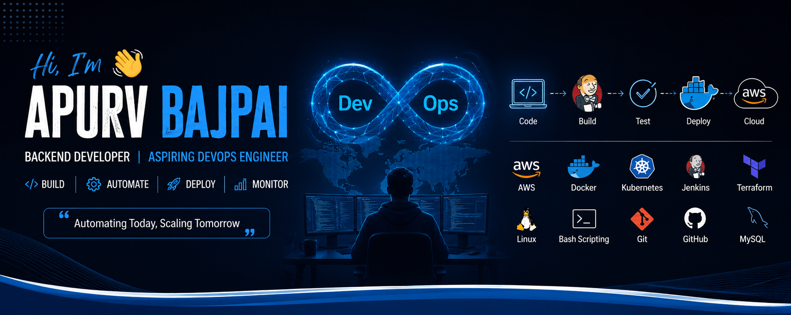

<h1 align="center">Hi 👋, I'm Apurv Bajpai</h1>

<h3 align="center">
Backend Developer | DevOps Enthusiast ☁️ | 1+ Years of IT Industry Experience
</h3>

  

  

  

  

  

---

# 🚀 About Me

- 🎓 B.Tech Computer Science Graduate
- 💻 Backend Developer (Ruby on Rails)
- ☁️ Learning AWS, Docker, Kubernetes & Terraform
- 🔭 Building DevOps and Cloud Projects
- 🌱 Exploring CI/CD Pipelines & Infrastructure Automation
- 🐧 Linux Enthusiast
- ⚡ Passionate about Automation and Cloud Technologies

---

# 🛠️ Tech Stack

### Languages

### Backend

### DevOps & Cloud

---

# 📊 GitHub Analytics

  

  

---

# 🌐 Connect With Me

- LinkedIn: https://www.linkedin.com/in/apurv-bajpai-99382324a
- Email: apurvbjp@gmail.com
- GitHub: https://github.com/Apurvbajpai2531

<h3 align="center">⭐ Always Learning • Building • Automating ⭐</h3>
